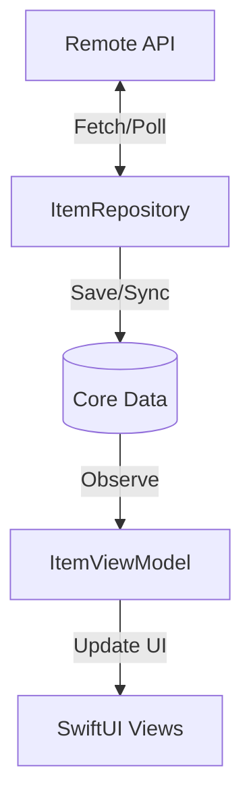

# Grocery App - iOS Take Home Demo

A robust, offline-first iOS application that demonstrates clean architecture, persistent storage, and real-time synchronization.

## 📱 Project Overview

This app fetches a collection of grocery items from a remote source, displays them in a beautifully styled list, and supports full offline functionality. It handles complex data merging and periodic polling to simulate a real-time experience.

### Technical Stack
- **Swift Version**: 5.9+
- **iOS Version**: 16.0+
- **Xcode Version**: 15.0+
- **UI Framework**: SwiftUI
- **Persistence**: Core Data
- **Concurrency**: Swift Concurrency (async/await)

---

## 🏗 Architecture

The project follows a clean **MVVM-Repository** pattern to ensure separation of concerns and high testability.

### Layers
1. **Views (SwiftUI)**:
   - `GroceryListView`: The primary screen showing the list of items with sync status and pull-to-refresh.
   - `GroceryDetailView`: Detailed view for individual items, accessible offline.
   - `GroceryItemRow`: Custom component for list items with status-based color coding.
2. **ViewModel (`ItemViewModel`)**:
   - Manages UI state and handles the 10-second polling logic.
   - Observes Core Data changes to keep the UI in sync.
3. **Repository (`ItemRepository`)**:
   - The "Source of Truth" coordinator.
   - Orchestrates data flow between the Network Client and Core Data Persistence.
4. **Networking (`MockNetworkClient`)**:
   - Simulates a REST API with realistic delays and dynamic data updates/additions.

### Data Flow & Offline Logic


#### Merge Strategy (Idempotency)
- When a sync is triggered (app launch, refresh, or 10s poll), the repository fetches remote data.
- For each item, it checks if an entry with the same `id` exists in Core Data.
- **Update**: If the item exists and the remote `updatedAt` is newer than the local copy, it updates the record.
- **Insert**: If the item is new, it creates a new record.
- This ensures that UI "thrashing" is minimized and data integrity is maintained.

---

## 🚀 App Flow

1. **Launch**: The app immediately loads the last cached dataset from Core Data.
2. **Initial Sync**: A background sync is triggered to fetch the latest remote state.
3. **Polling**: Every 10 seconds, the app polls the mock server for "real-time" updates (new items or status changes).
4. **User Interaction**:
   - **Pull-to-refresh**: Manually triggers a high-priority sync.
   - **Detail View**: Tapping an item opens a full-screen overview, available even without internet.

---

## 🛠 Project Setup Guide

### Prerequisites
- macOS running Xcode 15.0 or later.
- iOS 16.0+ Simulator or Device.

### Installation
1. **Clone the project**:
   ```bash
   git clone <repository-url>
   cd "Take Home Demo"
   ```
2. **Open the project**:
   - Double-click `Take Home Demo.xcodeproj` to open it in Xcode.
3. **Run the app**:
   - Select a destination (e.g., iPhone 15 Simulator).
   - Press `Cmd + R` to build and run.
